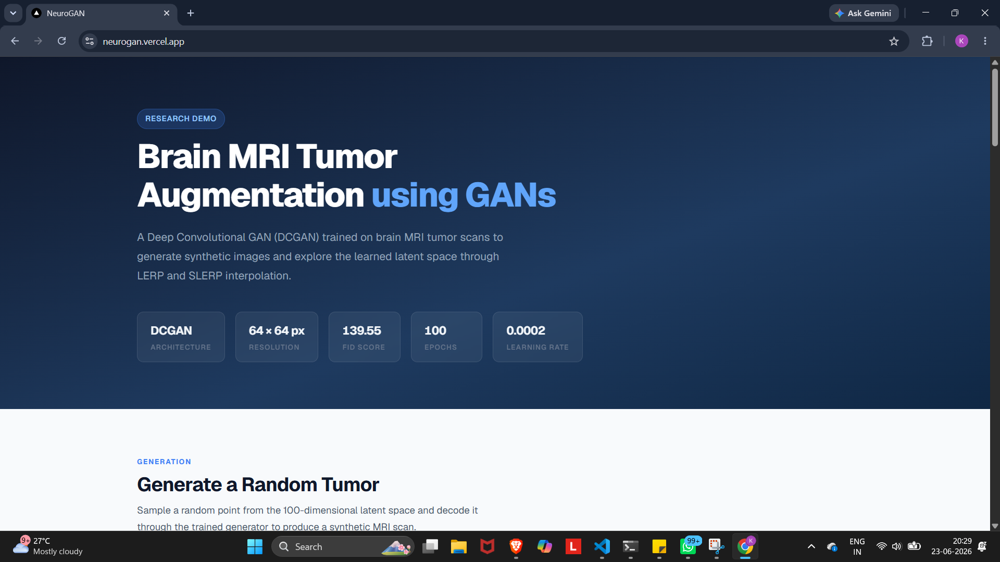
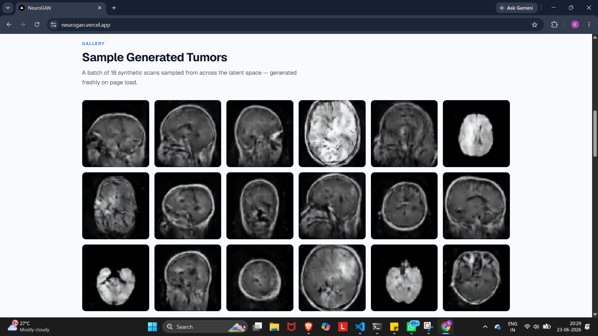
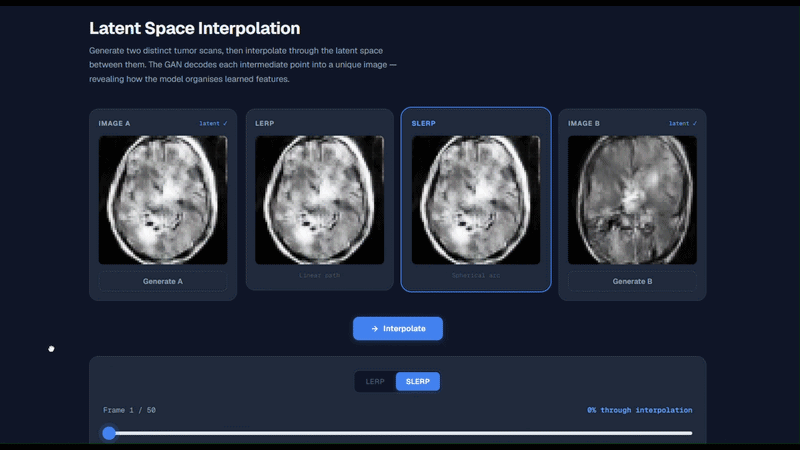

# NeuroGAN

A lightweight demonstration of GAN-based MRI synthesis and latent-space interpolation for synthetic brain tumor imagery.

## Overview

This project showcases how a generative model can produce realistic brain tumor scans from random latent vectors and how interpolation in latent space can create smooth transitions between generated samples.

The focus is on the ML pipeline:
- A DCGAN-style generator trained to decode a 128-dimensional latent vector into a 64×64 RGB image.
- Latent interpolation using both linear interpolation (LERP) and spherical linear interpolation (SLERP).
- Visualization of synthetic tumor samples and how latent paths evolve between two points in the learned manifold.

## Gallery

A selection of synthetic MRI scans from the generator, which shows images generated from random tensors distributed across the latent space.

## GAN Architecture

The generator is a classic convolutional decoder built with `torch.nn.ConvTranspose2d` blocks:
- Input: 128-dimensional noise vector reshaped to `128×1×1`
- Four upsampling transpose-convolution layers with batch normalization and ReLU
- Final output layer producing `3×64×64` images with `tanh` activation

This architecture is designed for stable training on small medical-image datasets and to reconstruct visually coherent synthetic MRI-style scans.

## Interpolation Methods

The project demonstrates two common interpolation strategies in the GAN latent space:

- **LERP (Linear Interpolation)**
  - Computes a straight line between two latent vectors.
  - Easy to implement and useful for quick comparisons of how examples blend.

- **SLERP (Spherical Linear Interpolation)**
  - Interpolates along the spherical surface of the latent space.
  - Better preserves vector magnitude and often produces smoother transitions between GAN samples.

These interpolation techniques let you inspect the generator’s learned manifold, and they reveal how subtle changes in latent variables affect the generated image.

## Use Cases and Motivation

Synthetic data generation and latent interpolation are useful for:
- augmenting scarce medical image datasets,
- exploring variation within learned tumor appearance,
- understanding how the model captures continuous changes in appearance.

While this demo generates synthetic tumor-like scans and interpolates, a production-ready diagnostic tool for early-detection of brain tumors may also be developed using the same technology. However, it would require the training of a class-aware DCGAN using a much larger, high-resolution dataset for reliable inferences.

## Tech Stack

- **Python**
- **PyTorch** for the GAN generator and latent-space inference
- **FastAPI** for the lightweight inference backend
- **Next.js** for the frontend visualization layer

## Notes

This repository is intended as a demonstration of generative synthesis and interpolation behavior rather than a clinical diagnostic tool.

Made by Kapil Mulay

